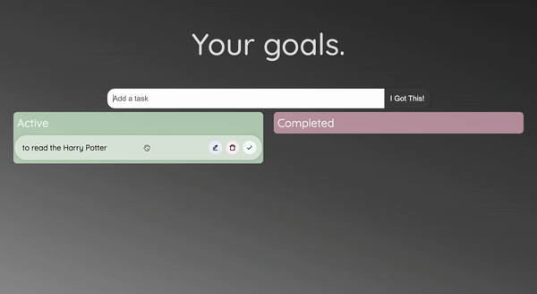

# Advanced ToDo 💡📝

The React ToDo using TypeScript and Drag-and-Drop Technology

## Features

- Drag and Drop Animation
- Editing todos
- Deleting todos
- Mark todo as done


## FAQ

#### How long has it been in development?

Development took 1 day


## Screenshots




## Run Locally

Clone the project

```bash
  git clone https://github.com/thatsfov1/typescript-advanced-todo.git
```

Go to the project directory

```bash
  cd typescript-advanced-todo
```

Install dependencies

```bash
  npm install
```


